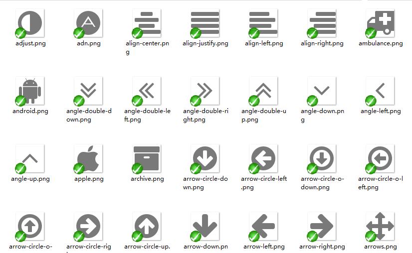

FontAwesome Axure Library
=========================

FontAwesome icon font for Axure 7+

## Demo

## How to use FontAwesome in Axure

1. Install the [FontAwesome font](./fonts/FontAwesome.otf?raw=true) to your fonts directory.

2. Click Publish > Generate HTML Files, In the popup box add FontAwesone in Web Fonts section.
	
	- Name: FontAwesome
	- URL: https://maxcdn.bootstrapcdn.com/font-awesome/4.1.0/css/font-awesome.min.css

3. Download FontAwesome Axure Library below for free and load it your library. Then you can use it to your prototypes.

See [the demo rp file](./demo.rp?raw=true) for how to use it.

## Download

-	For Axure 7: [FontAwesomeV4.10_7.rplib](FontAwesomeV4.1.0_7.rplib?raw=true)
-	For Axure 8: [FontAwesomeV4.10_8.rplib](FontAwesomeV4.1.0_8.rplib?raw=true)